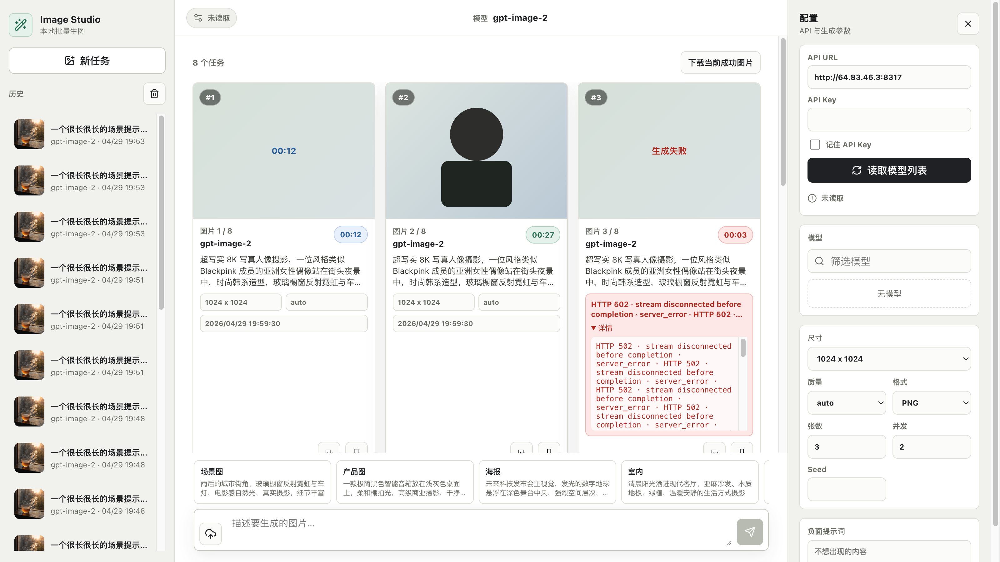
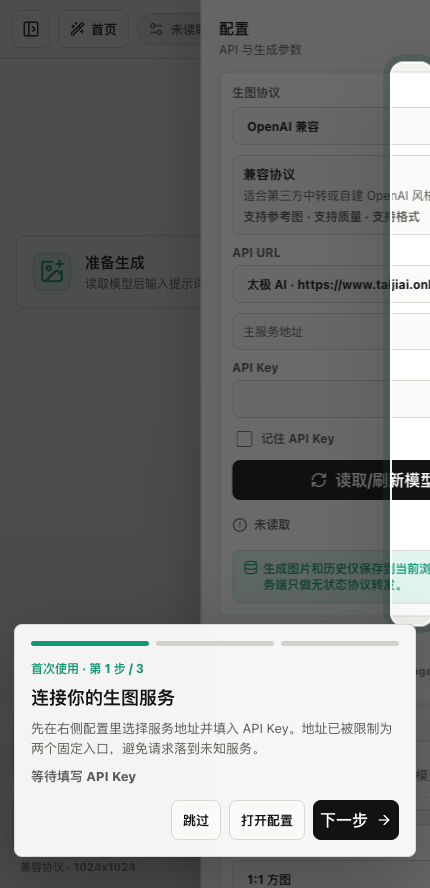
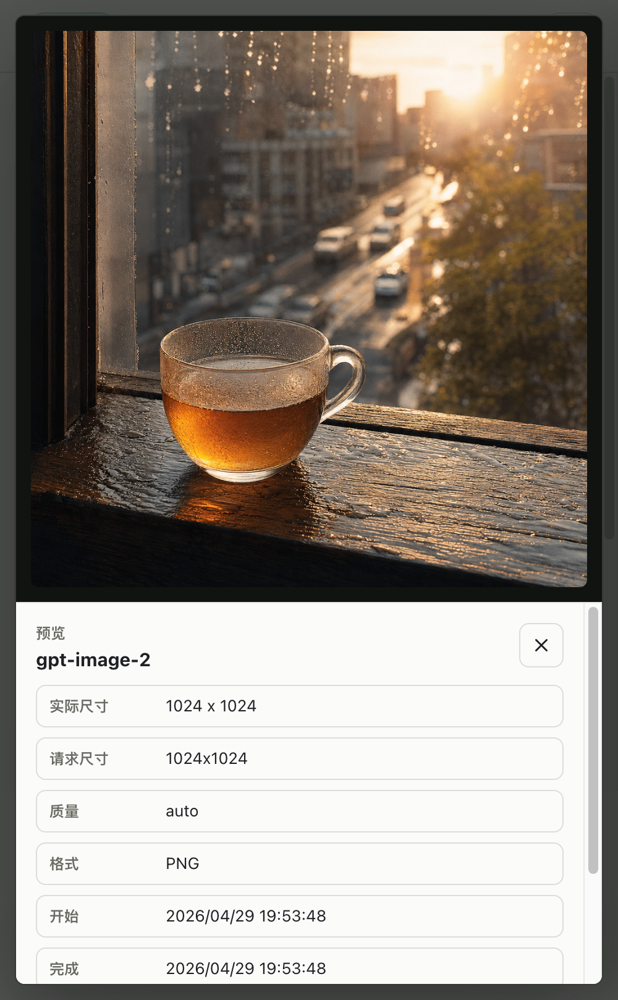
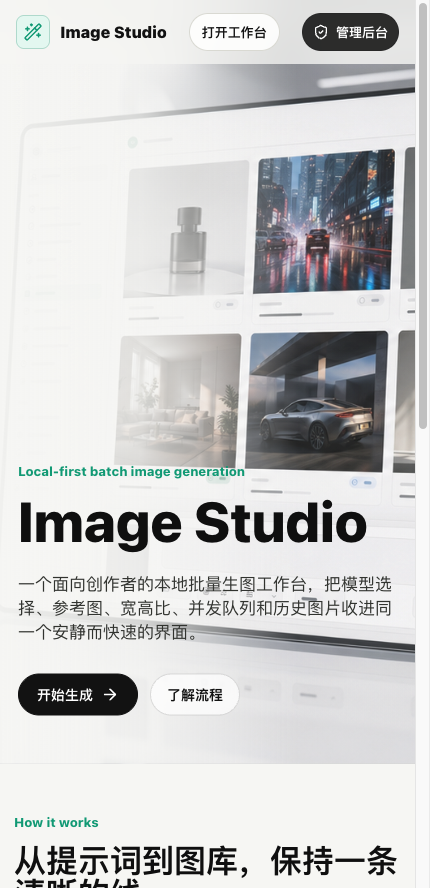
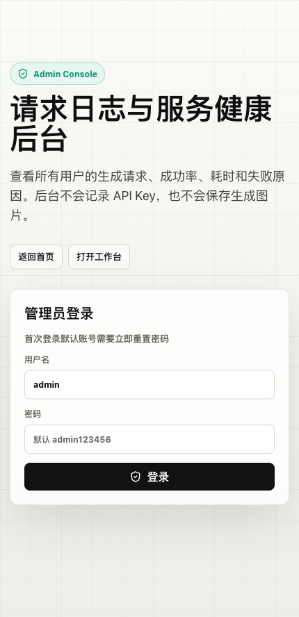
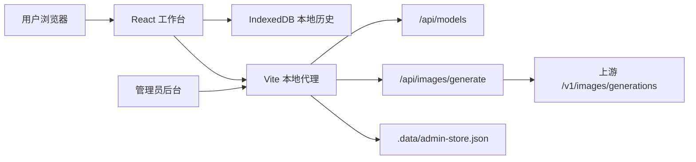

# ImageHub / Image Studio

ImageHub 是一个面向创作者和运营团队的本地优先生图工作台。它把模型读取、批量生成、参考图、宽高比、并发队列、浏览器本地图库和管理员日志后台放在同一个流畅界面里，适合快速探索图片方向、批量产出素材，并保留可追溯的请求记录。



## 核心能力

- 批量生图：一次提交多张图片，支持并发队列、实时耗时、成功/失败状态。
- 模型列表自动读取：填写 API Key 后会自动尝试读取模型列表，用户也可以手动刷新。
- 模型选择限制：只允许选择 `gpt-image-2`、`gpt-5.4-image-2` 或名称中包含 `image-2` 的模型。
- 固定 API 入口：前端请求地址只能选择 `https://www.taijiai.online/` 或 `https://bobdong.cn/`。
- OpenAI 图片接口：生成接口走 `/v1/images/generations`，并通过本地 Vite 代理统一处理请求。
- 参考图与提示词：支持上传参考图、填写正向提示词和负面提示词。
- 常用宽高比：内置 1:1、4:5、9:16、16:9、21:9 等常用比例，并自动推导请求尺寸。
- 本地图库：生成结果、提示词、模型、参数、尺寸和耗时保存在当前浏览器 IndexedDB。
- 图片预览：生成完成后可打开大图预览、复制提示词、下载单图或批量下载。
- 首次使用引导：新用户第一次进入工作台会看到带蒙版的分步高亮引导。
- 管理员后台：记录所有请求的 `requestId`、提示词、模型、参数、状态、耗时和失败详情。

## 产品截图

### 工作台

中间区域以平铺画廊展示所有生成记录，右侧配置 API、模型、宽高比、质量、格式、张数与并发，底部输入区用于提示词和参考图。



### 图片预览

生成完成后可以进入预览模式，查看原图比例、尺寸、生成参数和提示词。



### 首页

首页用于介绍项目能力，并提供进入工作台和管理后台的入口。



### 管理后台

管理员可以查看请求统计、成功率、失败分布和日志明细。后台不保存生成图片、不保存 API Key、不保存参考图内容。



## 系统架构



## 数据与隐私策略

图片历史采用 local-first 设计：

- 生成图片 Blob 只保存在当前浏览器 IndexedDB。
- 生成提示词、模型、参数、尺寸、耗时和错误详情保存在浏览器本地历史。
- 服务端管理员日志只记录请求元信息和结果状态。
- 服务端不记录 API Key。
- 服务端不保存图片数据、图片 URL、图片 Base64 或参考图内容。
- `.data/admin-store.json` 是本地运行时数据，已通过 `.gitignore` 排除。

## 管理员系统

后台地址：

```text
http://localhost:8877/#admin
```

默认管理员：

```text
用户名：admin
密码：admin123456
```

首次登录后系统会要求重置密码。也可以通过环境变量配置初始管理员：

```bash
ADMIN_USERNAME=admin ADMIN_INITIAL_PASSWORD=your-password npm run dev
```

管理员后台能力：

- 查看总请求数、成功率、失败数、平均耗时。
- 查看模型使用分布。
- 查看常见失败原因。
- 按状态和关键词筛选日志。
- 查看请求 `requestId`，便于和用户侧错误对齐排查。

## 本地启动

项目使用 Vite + React + TypeScript，默认端口固定为 `8877`。

```bash
npm install
npm run dev
```

打开：

```text
http://localhost:8877/
```

构建生产包：

```bash
npm run build
```

本地预览：

```bash
npm run preview
```

## 使用流程

1. 打开首页并进入工作台。
2. 在右侧配置区选择 API URL。
3. 填写 API Key，系统会在停止输入 1 秒后静默尝试读取模型列表。
4. 选择可用的 `image-2` 模型。
5. 设置宽高比、质量、格式、张数、并发和 Seed。
6. 输入提示词，必要时上传参考图。
7. 点击生成，任务会进入中间画廊并显示实时耗时。
8. 生成完成后可以预览、复制提示词或下载图片。
9. 管理员可在后台查看请求日志和失败详情。

## API 代理

本地代理接口：

```text
POST /api/models
POST /api/images/generate
GET  /api/admin/me
POST /api/admin/login
POST /api/admin/logout
POST /api/admin/change-password
GET  /api/admin/stats
GET  /api/admin/requests
```

上游图片生成请求使用 OpenAI 兼容格式，核心端口为：

```text
/v1/images/generations
```

## 技术栈

- React 19
- TypeScript
- Vite 6
- lucide-react
- IndexedDB
- Vite dev middleware proxy
- 本地 JSON 管理员日志存储

## 适用场景

- 电商商品图批量探索
- 社媒封面和短视频封面生成
- 海报、场景图、人物图方向测试
- 多模型服务的生图接口验证
- 本地保留生成历史和失败排查记录

## 开发说明

仓库中的运行时数据不会提交：

```text
dist/
node_modules/
.data/
generated_images/
screenshot-*.png
```

README 中使用的项目截图保存在：

```text
docs/screenshots/
```

